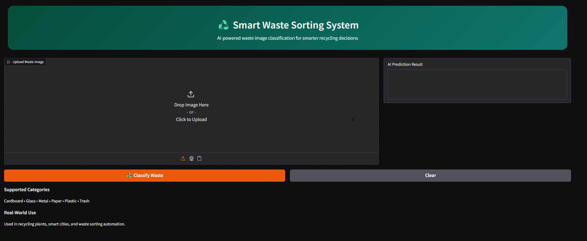
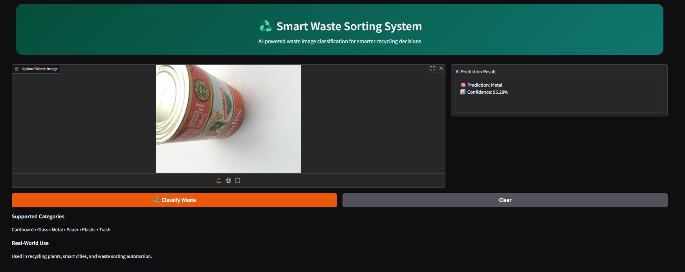

# ♻️ Smart Waste Sorting System (AI-Powered)


## 🌐 Live AI App

👉 https://shaida-ai-smart-waste-sorting-system.hf.space

---

## 🚀 Features

- Upload an image of waste material  
- AI-powered classification using deep learning  
- Displays prediction with confidence score
- Provides recyclability guidance (Yes / No / Conditional)
- Recommends appropriate waste disposal bin
- Real-time decision support for smarter recycling  
- Clean and interactive web interface using Gradio  
- Runs locally and as a live deployed application  

---

## 🧠 How It Works

1. User uploads an image  
2. Image is resized and normalized  
3. Deep learning model processes the image  
4. Model predicts the waste category  
5. App displays:
   - Predicted class
   - Confidence score
   - Recyclability status
   - Recommended disposal bin  

---

## 📸 Application Preview

### 🏠 Home Screen


### 🔍 Prediction Result


---

## ⚙️ Tech Stack

- Python  
- TensorFlow / Keras  
- Gradio  
- NumPy  
- Computer Vision (CNN / MobileNet)  

---

## 🚀 How to Run

1. Clone the repository:
```bash
git clone https://github.com/shaida-khan/smart-waste-sorting-system.git
cd smart-waste-sorting-system
```
2. Install dependencies:
```bash
pip install -r requirements.txt
```
3. Run the app:
```bash
python app.py
```
4. Open in browser (local):
http://127.0.0.1:7860

---

## 🚀 Real-World Use Case

This system goes beyond basic classification by providing actionable insights for waste management.  
It can assist individuals and organizations in making informed recycling decisions, improving sustainability practices, and reducing environmental impact.
